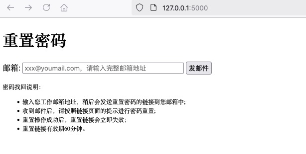
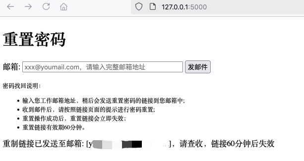
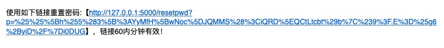
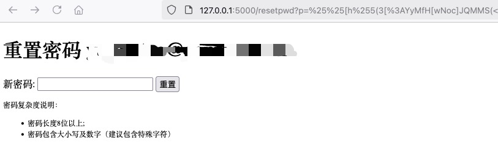

# Resetting Windows AD User Passwords Using Python, ldap3, and Flask
Password Reset:
* Input the correct email address of the user in Windows AD.
* Send a reset link to the user's email address.
* The user use a new AD password based on the reset link (no need to enter the old password).

# Simple Password Reset Page with Flask and Templates
# Redis for Storing Reset Link Expiration Time
* Default TTL is 60 minutes.
* The key is destroyed after the password is successfully reset, and the reset link becomes invalid.

#Docker Deployment
## Image Creation
Generate a build image based on the Dockerfile, using python3.13.0 as the base image.
```
docker build --force-rm -t winad:v0.1 .
```
## [Optional] Use the [slim](https://github.com/slimtoolkit/slim) tool to reduce the image size. The image size is reduced from 1.04GB to 104MB, approximately 10 times.

```
/opt/dslim-slim/dist_linux/slim build --expose 5000 --include-path /root --include-path /usr/local winad:v0.1

$ docker images
winad.slim     latest    c87a244deb6f   4 minutes ago    104MB
winad          v0.0      df1adcd66590   32 minutes ago   1.04GB
```
## Deployemntt use docker-compose 
```
$ docker compose ps
NAME          IMAGE               COMMAND                   SERVICE       CREATED             STATUS             PORTS
winad-app     winad.slim:latest   "python3 app.py"          winad-app     36 minutes ago      Up 36 minutes      0.0.0.0:5000->5000/tcp, :::5000->5000/tcp
winad-redis   redis               "redis-server /usr/l…"   winad-redis   About an hour ago   Up About an hour   6379/tcp
```

## Visual Result
The interface and template are very simple and do not have any beautiful CSS styles.
### Input email

### Send email

### Copy reset link

### Input new password


