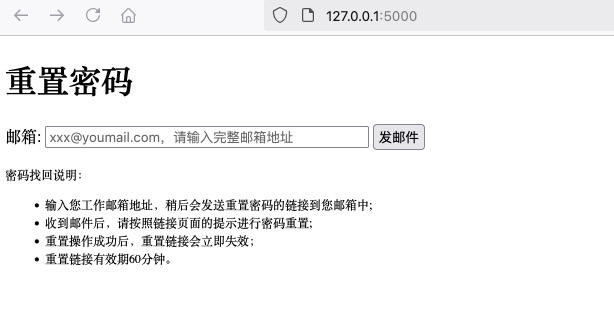
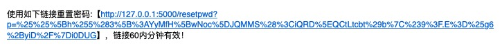
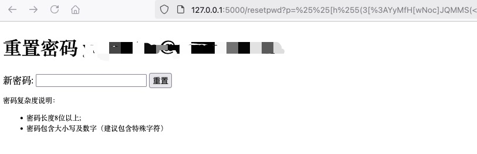

# 使用Python + ldap3修改[重置]Windows AD 用户的密码
密码修改流程：
* 输入AD中用户正确的邮箱地址
* 发送重置链接到用户邮箱
* 根据重置链接，用户可以输入新AD密码（无需输入旧密码）

# Flask + 模版 实现简单的密码重置页面

# Redis保存重置链接过期时间
默认ttl 60分钟，
密码重置成功后将key销毁，重置链接失效。

# Docker方式 部署
## 镜像制作 
根据Dockerfile生成build镜像，基础镜像为python3.13.0
docker build --force-rm -t winad:v0.1 .

##  [可选]，使用[slim](https://github.com/slimtoolkit/slim)工具缩减镜像大小，镜像大小从1.04G缩减到104M，10倍左右。
/opt/dslim-slim/dist_linux/slim build --expose 5000 --include-path /root --include-path /usr/local winad:v0.1

```
$ docker images
winad.slim     latest    c87a244deb6f   4 minutes ago    104MB
winad          v0.1      df1adcd66590   32 minutes ago   1.04GB
```

## docker-compose 部署
```
$ docker compose ps
WARN[0000] /data/codes/windows-ad/windowsad/docker-compose.yml: `version` is obsolete
NAME          IMAGE               COMMAND                   SERVICE       CREATED             STATUS             PORTS
winad-app     winad.slim:latest   "python3 app.py"          winad-app     36 minutes ago      Up 36 minutes      0.0.0.0:5000->5000/tcp, :::5000->5000/tcp
winad-redis   redis               "redis-server /usr/l…"   winad-redis   About an hour ago   Up About an hour   6379/tcp
```
# 效果图
界面及模版非常简单，没有美观的css样式

### 输入邮箱地址

### 发送邮件 

### 检查邮箱，复制重置链接

### 重置密码


